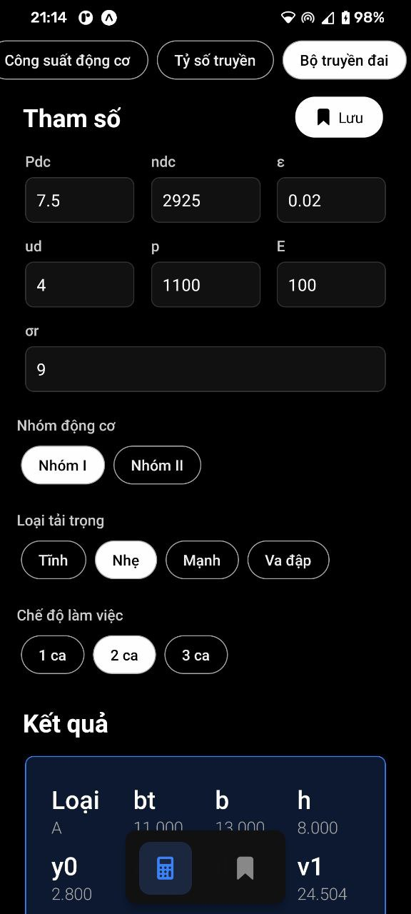
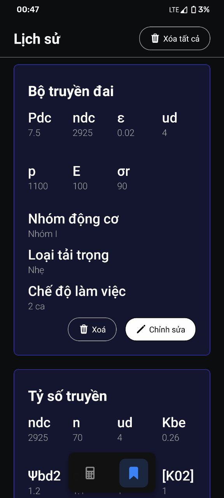

# Gearbox_specs_calculator
A react native app that takes in constraints like gearbox output power, load, RPM, etc and then returns motor model, gear diameter, transmission belt length. This app helps to aid the design process of a gearbox

## Screenshot of the app

  
  

